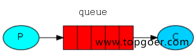
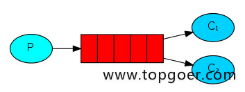
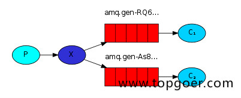
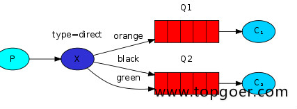
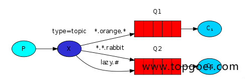
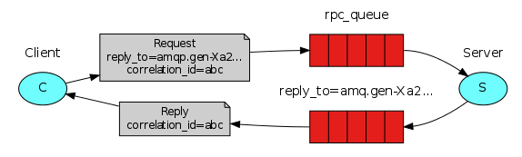

# myrabbitmq  240527
### simple 简单模式 --应用产景 聊天

消息产生着§将消息放入队列 消息的消费者(consumer) 监听(while) 
消息队列,如果队列中有消息,就消费掉,消息被拿走后,自动从队列中删除(隐患 
消息可能没有被消费者正确处理,已经从队列中消失了,造成消息的丢失)
应用场景:聊天(中间有一个过度的服务器;p端,c端)

### work工作模式(资源的竞争)

消息产生者将消息放入队列消费者可以有多个,消费者1,消费者2,同时监听同一个队列,
消息被消费?C1 C2共同争抢当前的消息队列内容,谁先拿到谁负责消费消息
(隐患,高并发情况下,默认会产生某一个消息被多个消费者共同使用,
可以设置一个开关(syncronize,与同步锁的性能不一样) 
保证一条消息只能被一个消费者使用)
应用场景:红包;大项目中的资源调度(任务分配系统不需知道哪一个任务执行系统在空闲,
直接将任务扔到消息队列中,空闲的系统自动争抢)

### publish/subscribe发布订阅(共享资源)

X代表交换机rabbitMQ内部组件,erlang 消息产生者是代码完成,
代码的执行效率不高,消息产生者将消息放入交换机,
交换机发布订阅把消息发送到所有消息队列中,对应消息队列的消费者拿到消息进行消费
相关场景:邮件群发,群聊天,广播(广告)

### routing路由模式

消息生产者将消息发送给交换机按照路由判断,路由是字符串(info) 当前产生的消息携带
路由字符(对象的方法),
交换机根据路由的key,只能匹配上路由key对应的消息队列,对应的消费者才能消费消息;
根据业务功能定义路由字符串
从系统的代码逻辑中获取对应的功能字符串,将消息任务扔到对应的队列中业务场景:error
通知;EXCEPTION;错误通知的功能;传统意义的错误通知;客户通知;利用key路由,
可以将程序中的错误封装成消息传入到消息队列中,开发者可以自定义消费者,
实时接收错误;

### topic 主题模式(路由模式的一种)

星号井号代表通配符
星号代表多个单词,井号代表一个单词
路由功能添加模糊匹配
消息产生者产生消息,把消息交给交换机
交换机根据key的规则模糊匹配到对应的队列,由队列的监听消费者接收消息消费

### rpc 模式

RabbitMQ的RPC模式，支持生产者和消费者不在同一个系统中，即允许远程调用的情况。
通常，消费者作为服务端，放置在远程的系统中，提供接口，生产者调用接口，并发送消息。
rpc 工作流程 ： 
1、生产者（Client）开始生产消息后，创建了匿名的、独一无二的回调队列。
2、生产者（Client）发送请求时，包含两个属性：reply_to，即回调队列；correlation_id，即用于标记请求的属性。
3、请求（request ）被发送到rpc_queue队列。
4、消费者（The RPC worker）等待请求，收到时，其处理生产者发送的特定的reply_to的消息。
5、生产者等待消息的ack回复，当收到回复后，其校验correlation_id，如果正确则回到应用程序中。